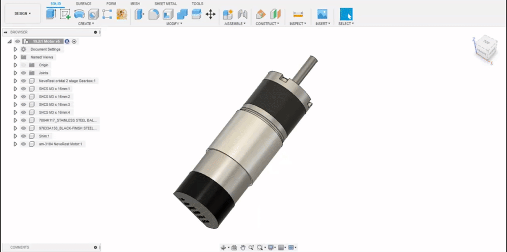
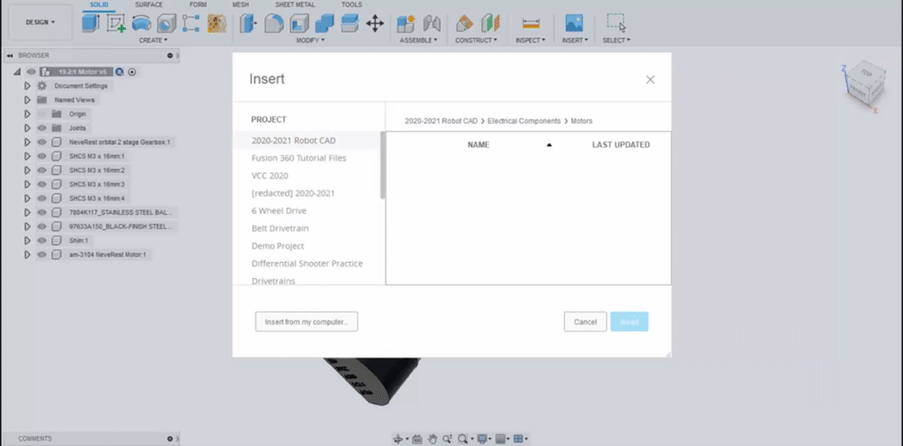
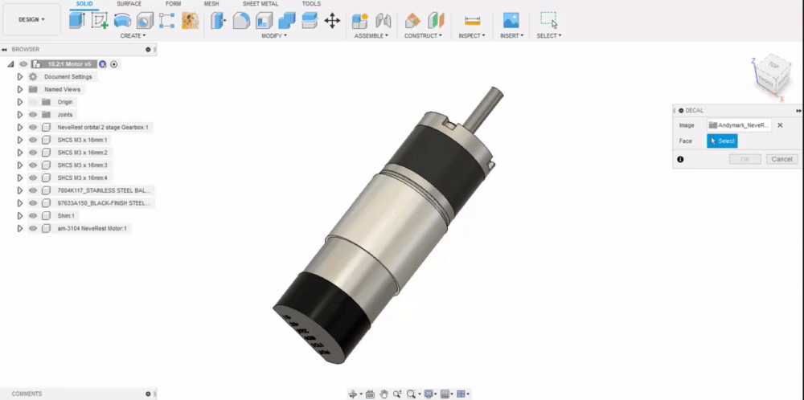
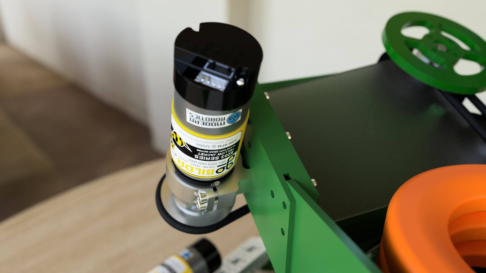

# Decals

Decals are images that can be wrapped around the face of parts. Unlike HDRIs, standard image file types are accepted \(such as .PNG and .JPG\). Most of the decals you will need can be found in the [**Decal Library**](https://photos.google.com/share/AF1QipNS1p_h-UilCHEvSoTZNdxclRQBJGjViyh_1pqrRcx0o8R58EYXR95usjRIjo5KHQ?key=OTZDX0daejE2aDhvM1RqcWJCZi1iNks1LWpralVB). 

1. To attach a decal to your model, navigate to the "Insert" menu within the design studio, and select the first option, "Decal", from the drop-down menu.

   2. Locate the decal source image on your computer and select it.

   3. Select the face for the decal to be applied to; orient and resize appropriately. Finally, turn off chain faces as this will create an undesired wrapping of the decal.


The _Chain faces_ option causes the decal to display on multiple faces which are "chained". While this could be desirable for some niche use cases, it usually causes the decal to not be mapped properly, often distorting and seemingly clipping through faces.


