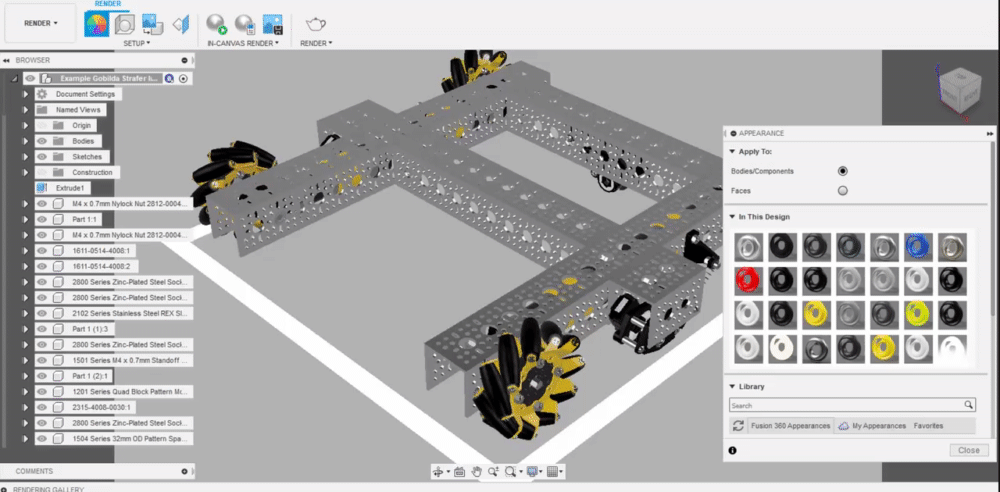
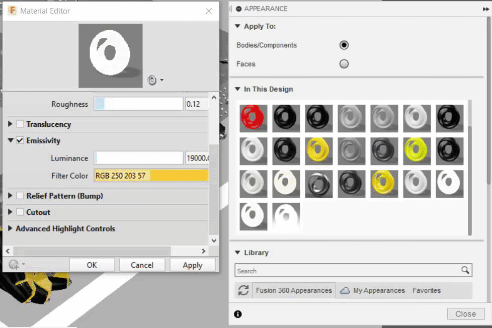
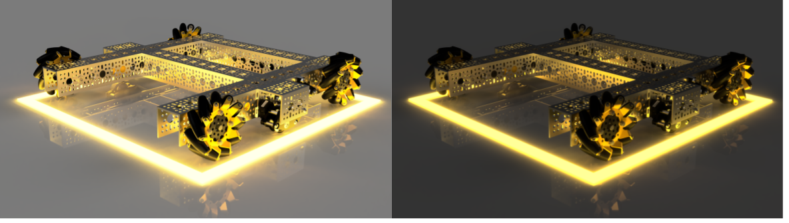

# Emissive Appearances

While not commonly used, emissive appearances can provide additional lighting to the scene and highlight certain parts of the render. Emissive appearances can be accessed through the "Miscellaneous" and then "Emissive" folders of the appearance menu.

### Changing the Emission Color

1. While changing the emission color is not as straight forwards as changing the color of a standard appearance, it is still fairly simple. The color should be changed in all 3 places shown below to have the proper coloring.

### Adjusting the Luminance

Much like the brightness of the scene can be adjusted, the brightness of emissive materials can be adjusted. Adjusting the brightness to a proper level can be hard without running ****[**In-Canvas Renders** ](../rendering-and-exporting/cloud-vs.-local-rendering.md)to check the current look of the render in real time.

### Post-Processing

Unlike renders without emissive materials, the rendered output often looks off, with additional work needed to achieve the desired look. The [**post-processing**](../rendering-and-exporting/post-processing.md) page covers this in detail, but consider adding some bloom, decreasing exposure, and increasing the prominence of shadows.

