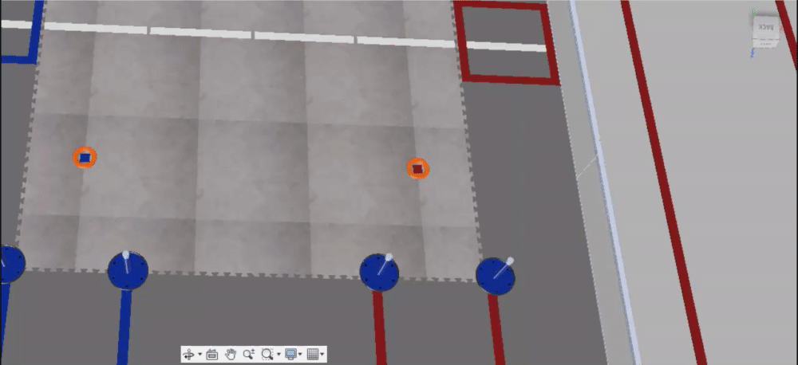

# Texture Map Controls

Often appearances are not mapped correctly \(such as the [field tiles example](making-custom-appearances.md)\), so a niche control option called texture map controls can be used to change the position and orientation of appearances.

To access the texture map controls, right-click on an object with a texture applied to remap it. While there are 5 projection types, box is the only really useful one. In the example below, the field tile texture is offset from the field tiles themselves, so this will be manipulated using the texture map controls.


While in the gif above the texture is repositioned and rotated semi-randomly, take note that simply selecting the box projection type aligned the texture with the field tile model properly.


