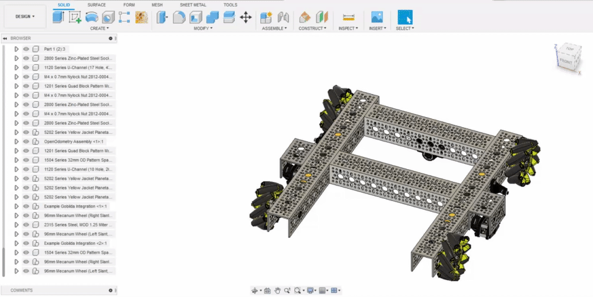

# Assigning Appearances

Assigning appearances to components is one of the most time-consuming parts of the rendering process. However, the process is pretty straight-forward.

1. Navigate to the "Appearance" tab \(or press the "A" key\)

   2. Locate the appearance in the drop-down. You can search in the search box using keywords, or you can also navigate for the appearance using the folders. 

    3. Drag and drop the appearance on the appropriate component. 

