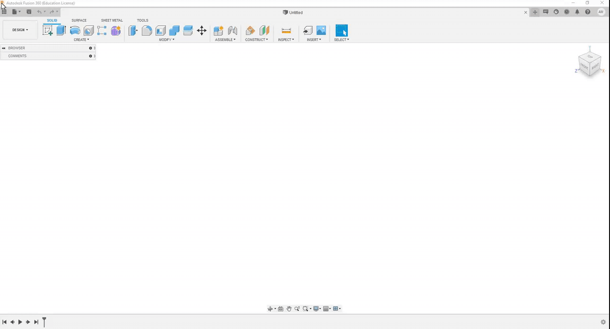

# Getting Started

If you already have your CAD file ready-to-go in Fusion 360, you can skip directly to the [Appearances ](assigning-appearances/)section. If not, this section will discuss how you can export your CAD file from another software and import it into Fusion. 



Once you have a CAD model that you would like to render, export it as a .STEP file. This process will vary depending on what software you used. 

The next step is importing it into Fusion, which is a simple process. Select _Open_ in the drop-down menu or press _ctrl_ + _O_ on your keyboard. Locate the .STEP file of the object you wish to render and select it. 

After this, you can open the drop-down menu in the top left-hand corner and switch from the _Design_ tab to the _Render_ tab_._

You are now ready for the next step!

