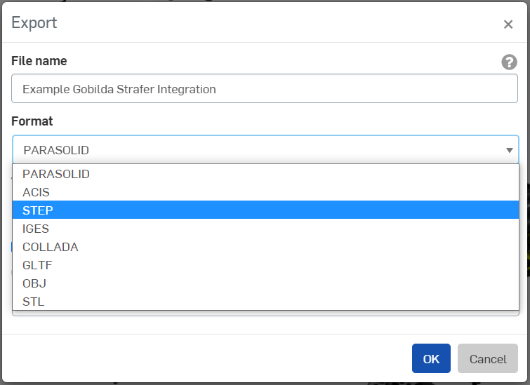

# Getting Started

If you already have your CAD file ready-to-go in Fusion 360, you can skip directly to the [Appearances ](assigning-appearances/)section. If not, this section will discuss how you can export your CAD file from another software and import it into Fusion. 



Once you have a CAD model that you would like to render, export it as a .STEP file. This process will vary depending on what software you used.

### Onshape

