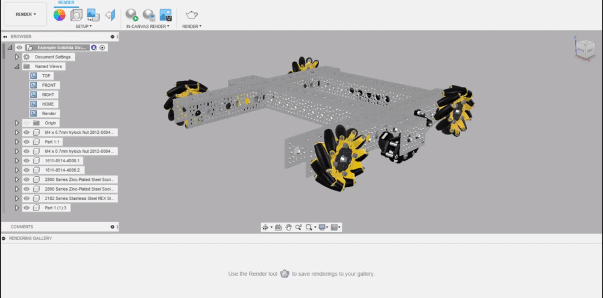
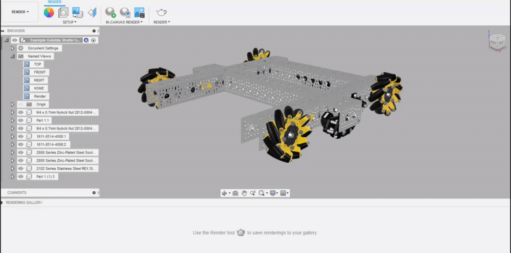
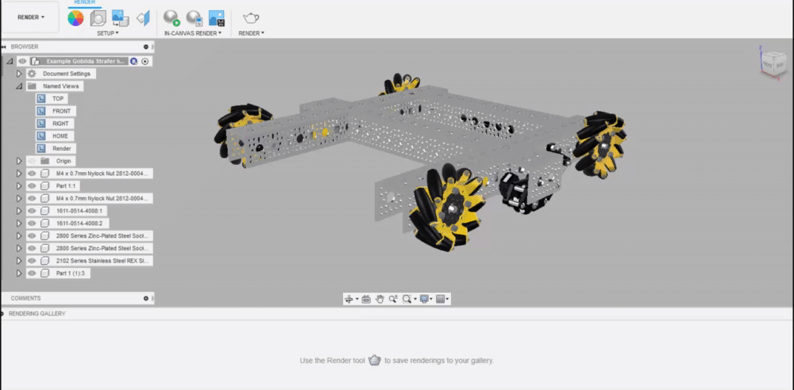
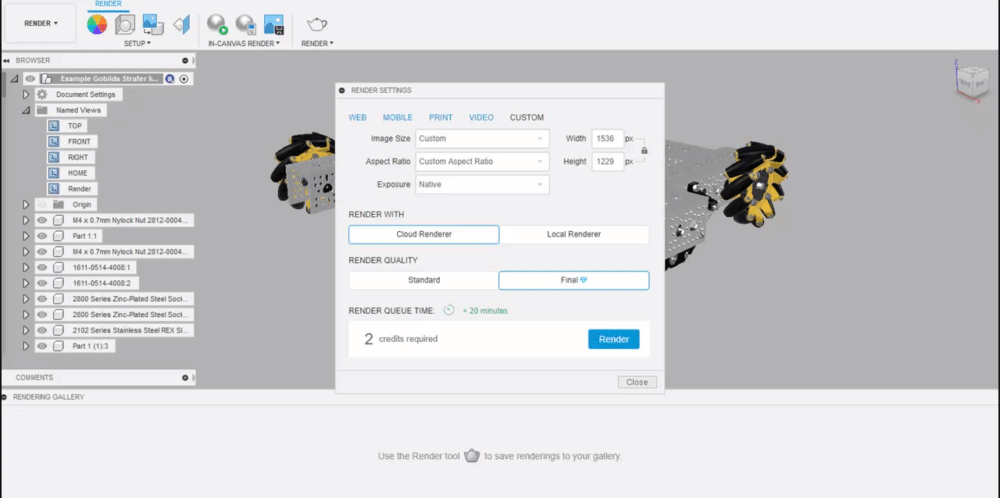
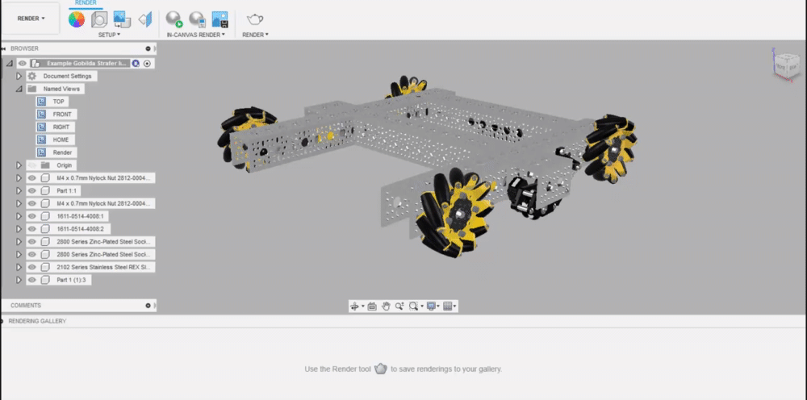
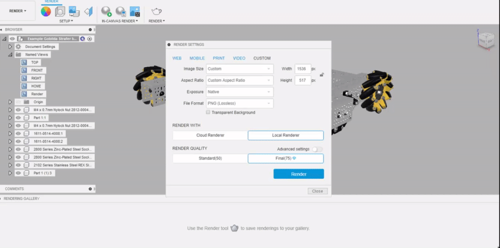

# In-Canvas vs. Cloud vs. Local Rendering

In-Canvas, Cloud, and Local are three rendering options within Fusion 360.

TLDR: In-Canvas should be used to get a quick sense of what your render is looking like and adjust camera position/angle, scene setttings, and appearances. Cloud should be used for final renders.



**In Canvas**

In-Canvas creates a low fidelity, real-time render of your model within the Fusion rendering environment. While this does produce lower quality results than Local or Cloud renders as it does not utilize ray tracing and can simplify the lighting based on the settings, it is an extremely useful tool for checking lighting, appearances, scene settings, and camera angles.

1. Select "Fast" or "Advanced" from the In-Canvas settings menu.


Fast reduces the material and lighting data, allowing the render to be executed faster, but at a much lower quality than what would be outputted in the advanced setting.


  2. Start the render by clicking the icon with the sphere and the green arrow.


The In-Canvas Render can be paused by pressing the pause button at the lower right and can be stopped by clicking the icon with the sphere and the red stop button.




**Cloud Rendering**

Cloud rendering is one of two options for creating final renders that are high resolution and high quality. While local rendering can be utilized to achieve a virtually exact output as cloud rendering, cloud renders are done on the Autodesk servers, allowing you to run multiple renders in parallel with no load on your computer. 

1. Click on the teapot icon to open the rendering menu, selecting "cloud render".

2. Select the aspect ratio, render quality, and resolution of the render.


Final render quality should always be selected during cloud renders, with a resolution above 1080p being used.


3. Hit render!



**Local Rendering**

Local rendering is one of two options for creating final renders that are high resolution and high quality. Cloud renders are prefered over local renders in almost every situation as local renders will take longer, load your local machine, and cannot be run in parallel. If for some reason, the Autodesk rendering servers are failing, this would be the rendering option to use for creating a final render.


Local rendering is generally not recommended in most cases unless you have a high-end computer and 


In addition to local renders being generally much less convenient, the post-processing features of cloud renders are unavailable in local renders.

#### How to Render Locally

1. Click on the teapot icon to open the rendering menu, selecting "local render".

2. Select the render quality setting, aspect ratio, file format, and resolution.

3. Hit render!



\*\*\*\*

