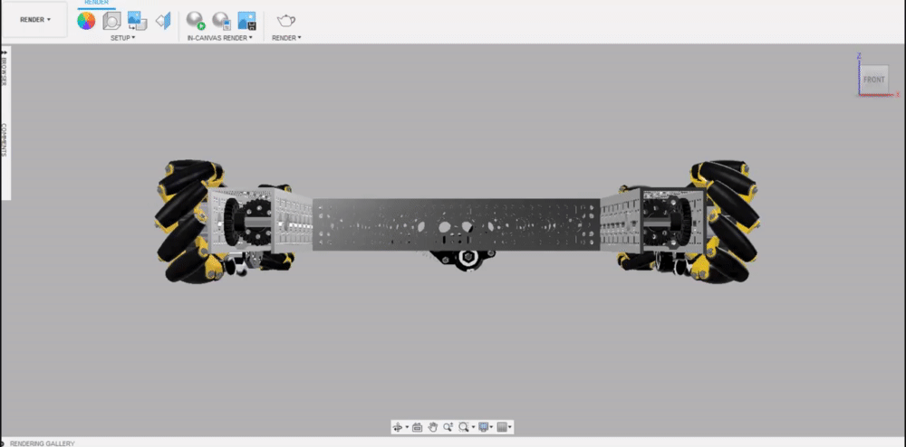
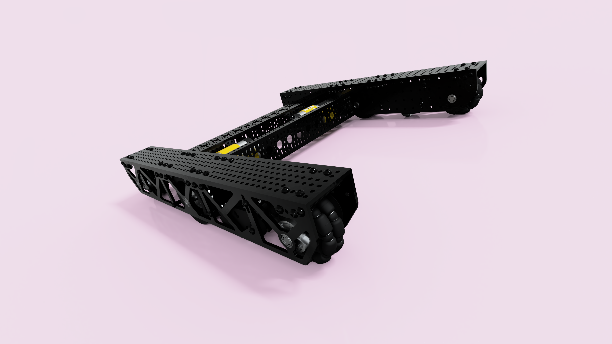

# Constrained Orbits

By default, Fusion 360 uses free orbit to interpret mouse input and rotate the camera relative to the model. While this is generally preferred for CADing, it often makes positioning the camera for renders frustrating. Constrained orbit rotates the camera about a singular axis, enabling precise camera manipulations.

The free orbit menu is accessed at the view menu at the bottom, bringing up a faint orbiting menu. There is a circle for rotating about the y-axis, and lines for rotating about the z and x-axis.


The constrained orbit is especially useful for creating an angled render, such as the one below.


