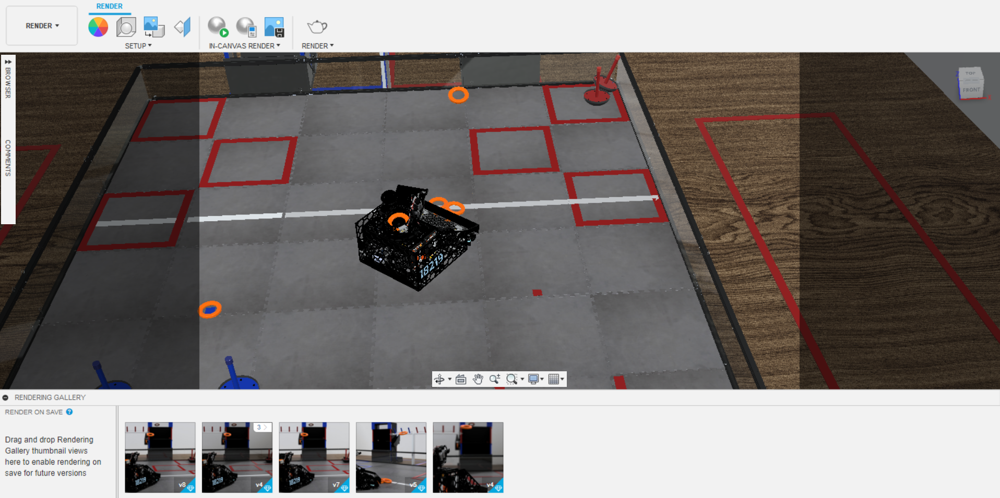
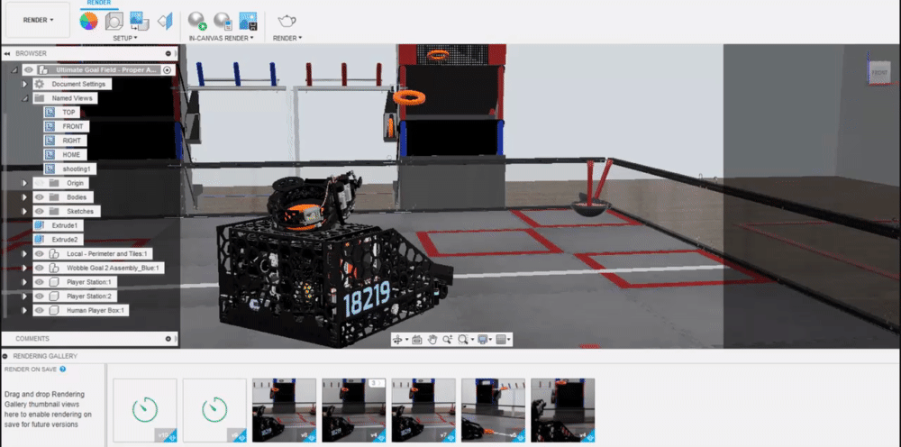
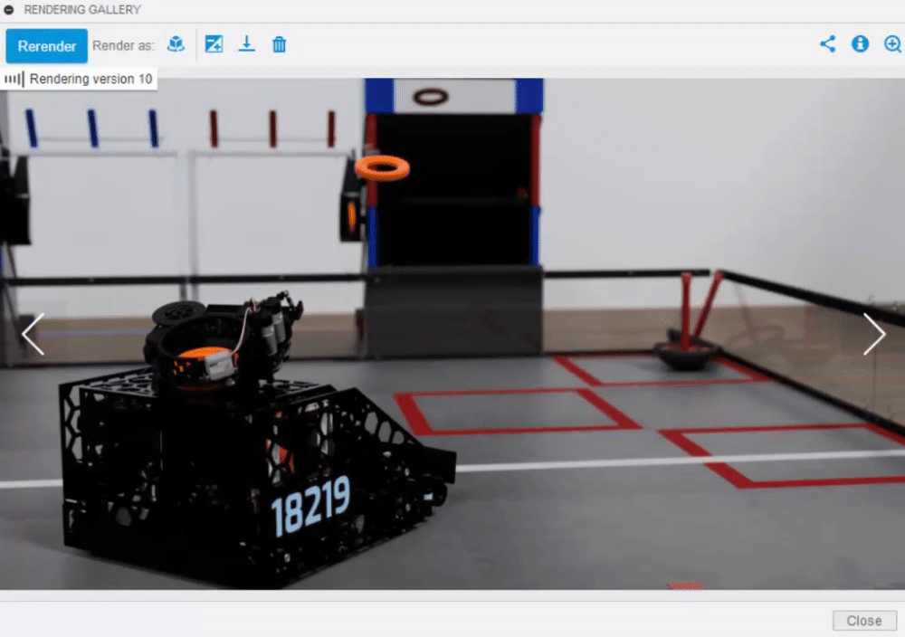

# Exporting/Saving Renders

After doing local or cloud renders, your completed renders will appear in the "Rendering Gallery" tab at the bottom of the render workspace.

1. To save a render, first click on the render in the rendering gallery.

2. After opening the render, click on the download icon, selecting the desired image format and saving to your computer.

