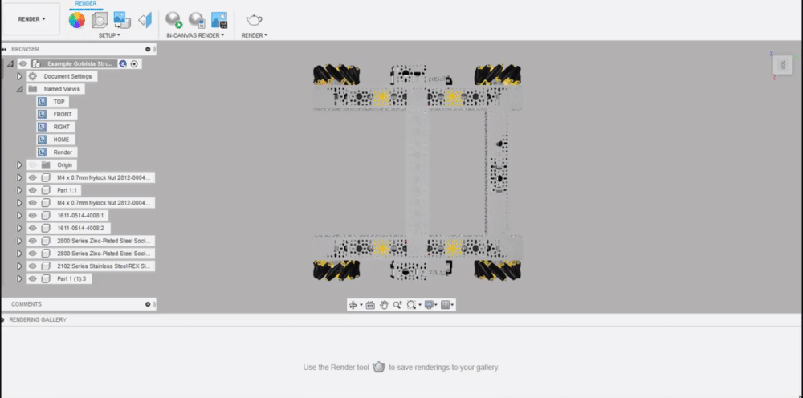
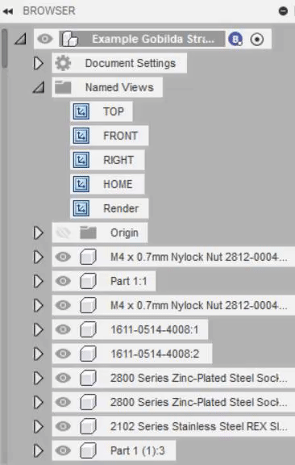
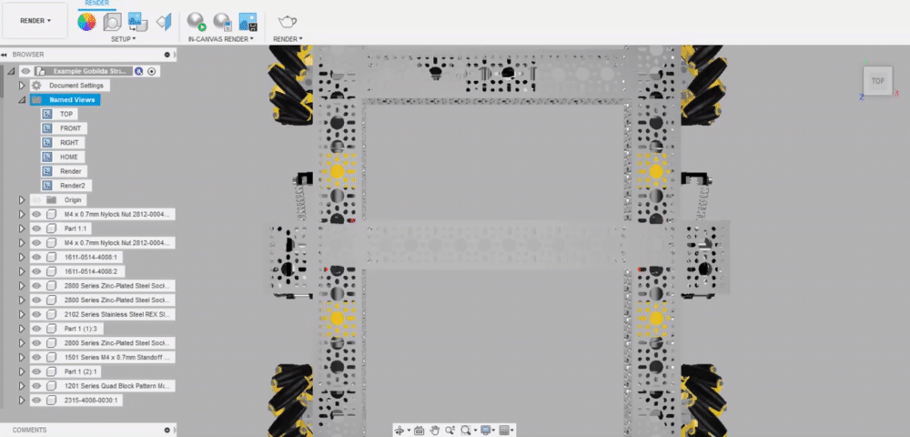

# Named Views

Much like the standard view angles on the view cube \(top, left, right, bottom, and isometric\), custom angles and camera position data can be stored. This allows you to easily setup camera positions to use in your renders.

1. Position the camera as you would like, setting the angle, pan, and zoom.

2. Right click on the _Named Views_ menu within the browser tree and select _New Named View_.

Now clicking on the view you just stored in the browser tree will automatically position the camera.

