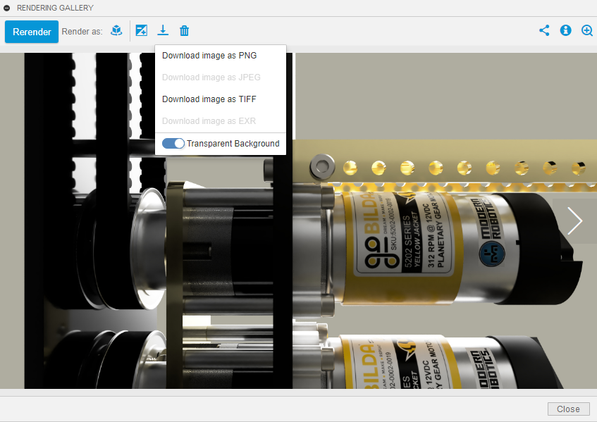

# Transparent Background

### How do I make the background of my renders transparent?

This is a frequently-asked question in the FTC Discord, so we decided to make a section about it. 

Setting the background to transparent comes after the render has finished. There is no custom environment or HDRI that one must use in order to have a transparent background. 


Although you can technically set the background to essentially any HDRI or color, be aware that its reflection can be seen in reflective objects \(e.g. acrylic and other plastics\)


Below is an example of a render that used a solid green background before exporting. The reflective field perimeter clearly shows hints of green, which is why **you may want to set the background to a more mute color.**

After your render has finished, click on the render and select the _Download_ icon. Here, you can slide the switch so that _Transparent Background_ is selected and then select the desired file type you wish to save the render as.

