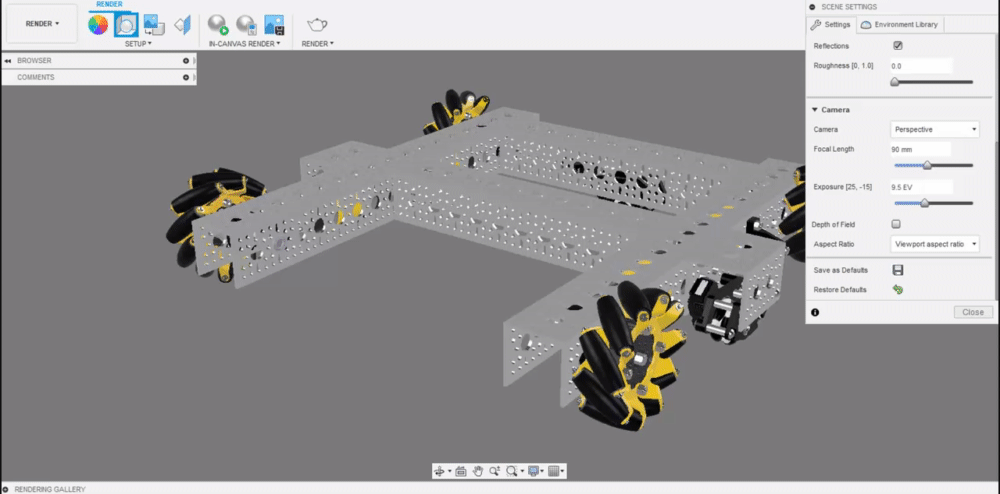

# Aspect Ratio

When rendering, you have to chose an aspect ratio. To see this aspect ratio when laying out the render you can switch the aspect ratio in the scene settings tab to view which parts of the model will be outside the frame. The excluded parts are denoted by dark gray bars.


Always use the aspect ratio you will be rendering in when preparing your render to make sure the model is positioned within the frame how you would like.


