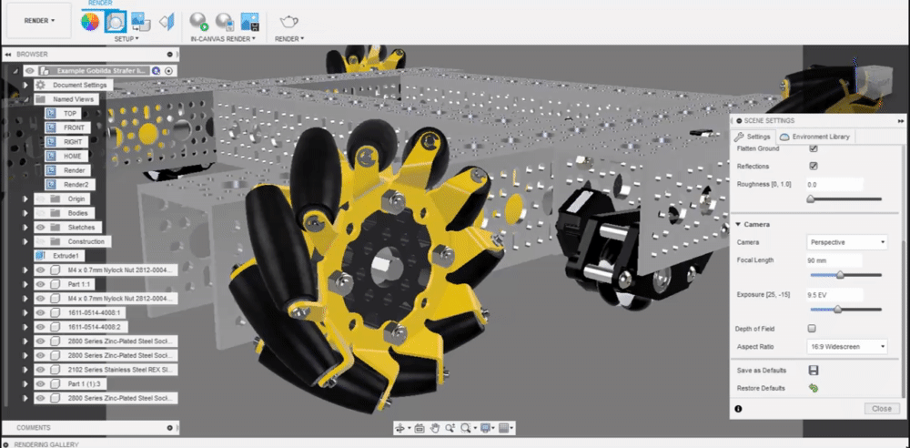
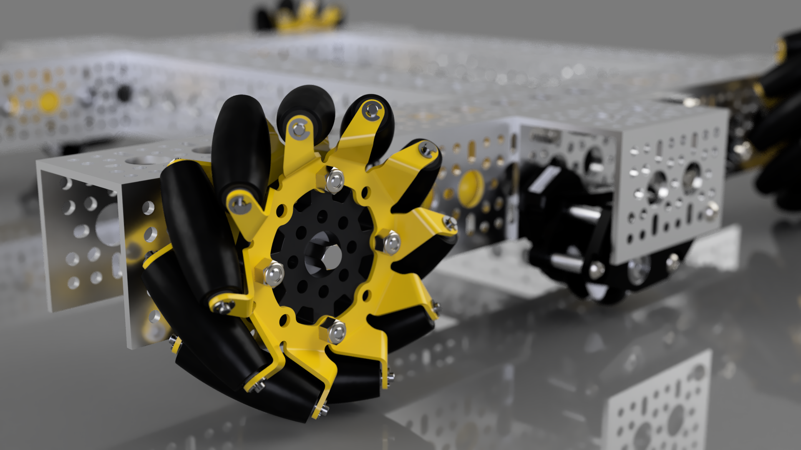

# Depth of Field

Depth of field is a setting that can be enabled and adjusted to achieve a blurred effect, much like the focus of a camera, where objects in the foreground or background are out of focus. Depth of field is great for highlighting parts of a render, such as an up close render, or blurring out the HDRI background to mimic the focus of a camera and hide the imperfections of the HDRI.

In the scene settings tab, enable the depth of field checkbox, select the center of focus, and adjust the blur.


The center of focus is placed in 3D space, so you may have to rotate the camera to achieve the proper depth.

For close up robot renders, the default blur of 1 is much too high. A value of around 0.2 is a good starting point. Additionally, for full field renders, a value of 1 - 1.25 works well.


