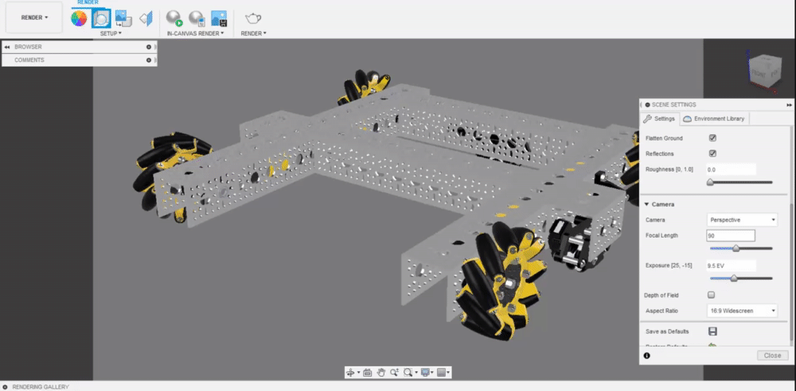
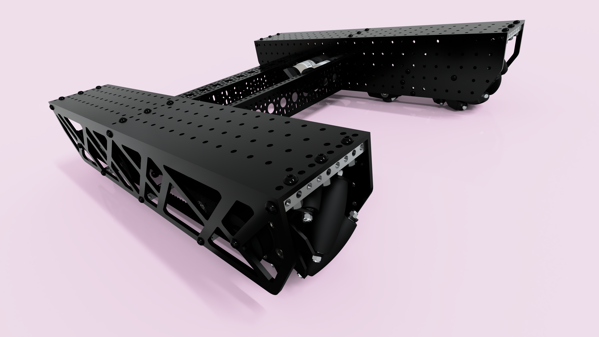

# Focal Length

While the default focal length is 90mm in Fusion 360, increasing or decreasing the focal length can give a stylized component to the render. We recommend a focal length in between 50-90mm for most renders, although sometimes a lower or higher focal length can be useful.


When approaching the lower extremes of the focal length, it often distorts the model which may be desired or undesired.


