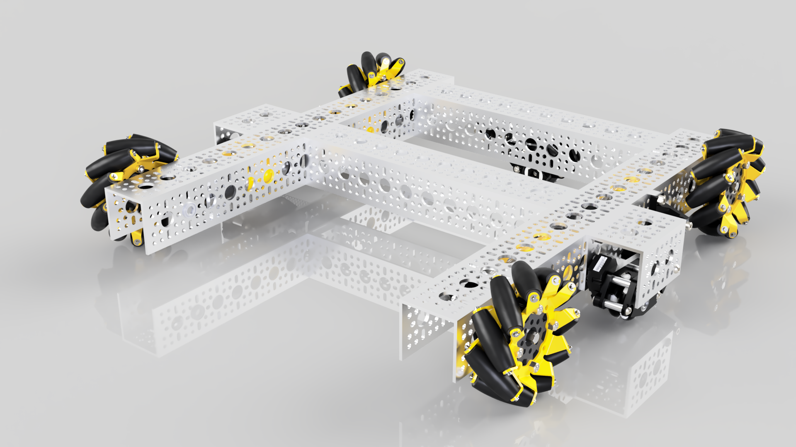

# Lighting

Lighting is a very important aspect of rendering that can either make or break your renders. It takes time to become experienced with this part, so don't worry if your first few renders look too dark or washed out.

### Brightness

Adjusting the brightness of the render simply changes how light or dark the scene is. Increasing the brightness will lighten both the light and darker areas; likewise, decreasing the brightness will darken the lights and darks. In Fusion, the brightness is measured in lux \(lx\). The default render brightness is 1000lx, which is generally the sweet spot for the majority of renders. However, this is affected by several factors such as the HDRI environment, the exposure, and the rendering angle. 

### Exposure

Exposure and brightness are two terms that are often interchanged; however, this is not correct. Unlike brightness, the exposure affects the highlights and tones with a bit more bias. It's a bit more complicated; however, you can follow the steps below to find the optimal intermediate of the brightness and exposure. Exposure is measured in _Exposure Value_ \(EV\) and unlike adjusting the brightness, a smaller exposure value lightens the image and a higher value darkens it.


If you notice that your exposure is marginally too high or low after rendering, do not worry. There is an option to adjust this and re-render in seconds. For details, check out [**Post-Processing.**](../rendering-and-exporting/post-processing.md)


1. Adjust the exposure until the proper highlights and tones are nearly achieved. This does not have to be perfect at first, because you will be adjusting the brightness.
2. Drag the brightness slider until the colors are neither too washed out nor too dark/shadowy. 
3. Repeat this process, but adjust the values in smaller increments. Feel free to spend time playing around with the sliders until you find a balanced medium\(the results are worth it\).

The render below features a render where the exposure value is too low, causing some of the metallic appearances to appear washed.

