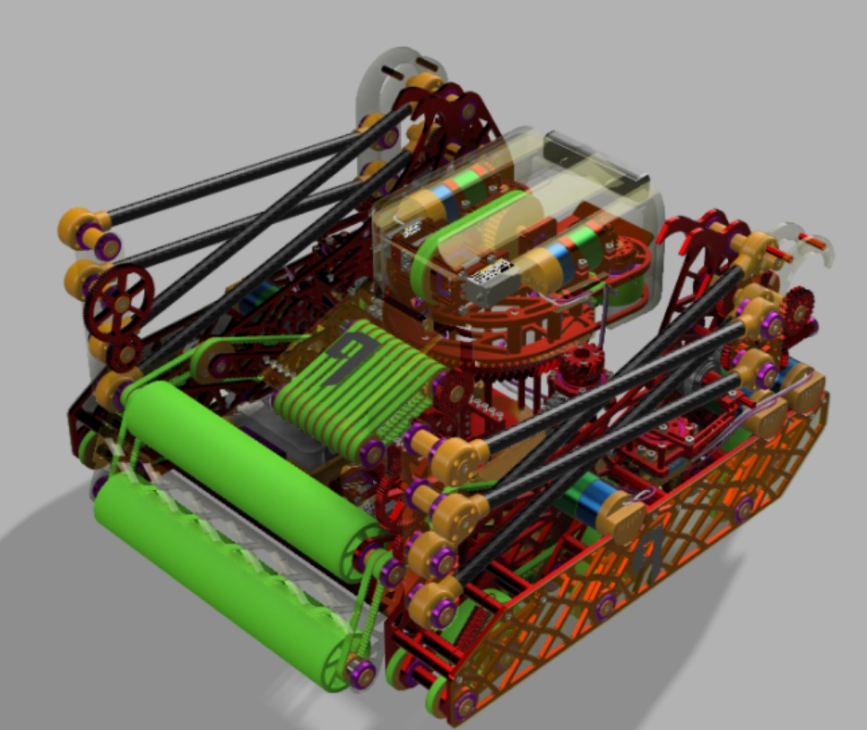
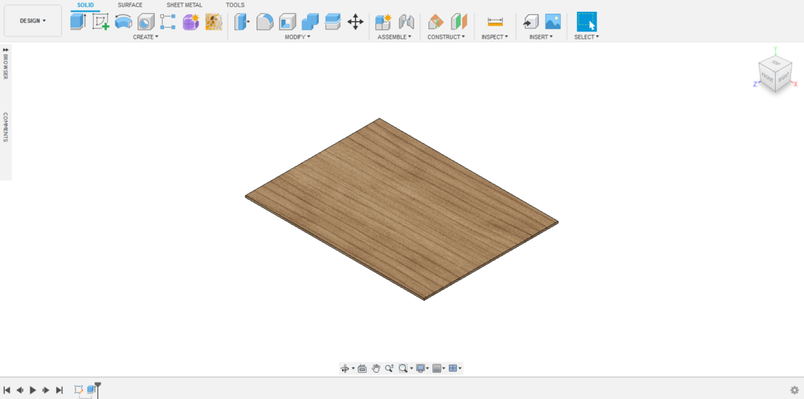
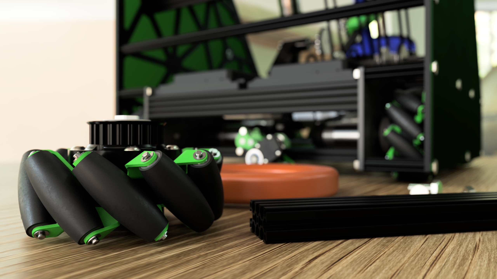

# Tips and Tricks

## General Tips

When assigning appearances to a robot with colors that are hard to distinguish from each other, it is best to separate each appearance by setting it to a vibrant color and changing it afterwards. For example, Team 9's robot in the CCC was mostly dark; as such the appearances were first set like below and then converted to shades of black and gray.

## Keyboard Shortcuts

* Instead of navigating to the _Appearances_ tab, you can press the _A_ key on your keyboard. This is one of the most useful keyboard shortcuts to know when rendering.

## Tables

Creating a table and placing your models on it in your renders can add another level of depth and realism to your renders. A simple extruded sketch with a wood appearance is all that is needed for this. You can refer to [Commonly Used Appearances](https://renders360.gitbook.io/ftc-rendering-in-fusion-360/assigning-appearances/commonly-used-appearances) for some of the wood appearances that we like to use.

## "Custom" Lighting

Sometimes, the [**HDRI**](scene-settings/hdris.md#hdris) or environment you are using just doesn't focus enough light on a certain area, no matter how much you rotate it. If this is the case, you can try creating "custom" lighting_._ This is done by creating three-dimensional bodies in an area that will not be visible in the render \(usually above the camera's position\) and applying an emissive appearance to them. 

